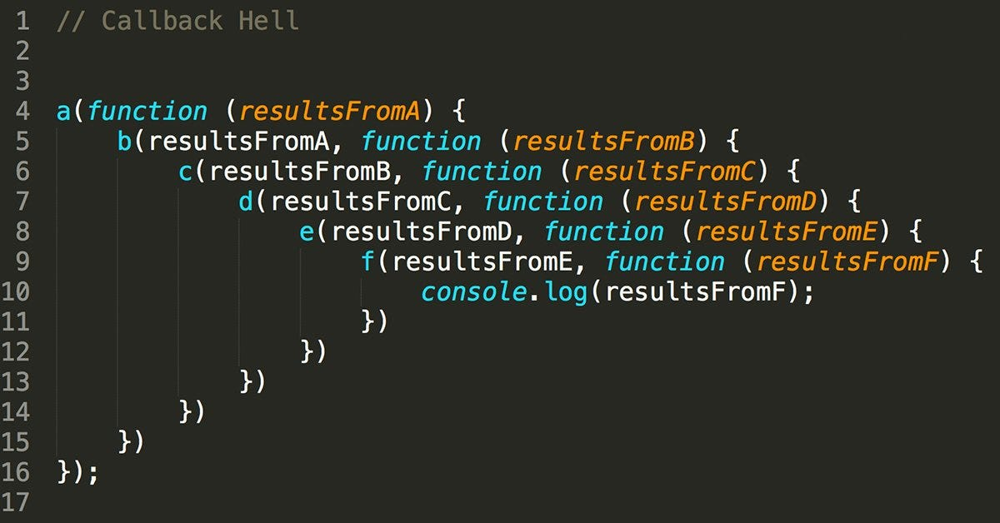

<h1 align="center">
  
</h1>

# Semana 7 - NodeJS: Event Loop, Callbacks, Promises e Async/Await

</br>

Turma Online 22 - B3 | Back-end | Semana 6 | 2023 | [Professora Milena Gomes](https://www.linkedin.com/in/milena-gr/) 


### Instruções
Antes de começar, vamos organizar nosso setup.
* Fork esse repositório 
* Clone o fork na sua máquina (Para isso basta abrir o seu terminal e digitar `git clone url-do-seu-repositorio-forkado`)
* Entre na pasta do seu repositório (Para isso basta abrir o seu terminal e digitar `cd nome-do-seu-repositorio-forkado`)


## **Conteúdo**

### [Programação Assíncrona](#programação-assíncrona)

### [Callbacks](#callbacks)

### [Promises](#promises)

### [Async/Await](#asyncawait)

### [Callback vs. Promises](#callback-vs-promises)

### EventLoop 
1. [O que é o Event Loop?](#1-o-que-é-o-event-loop)


## **Programação Assíncrona**

Nós entendemos o algoritmo como uma sequência de operações, que podem ser chamada de funções, execução de operações aritméticas, e execução de operações lógicas. 

Estamos acostumadas com o entendimento de forma síncrona dos algoritmos que produzimos, ou seja, um operação deve ser concluída para que a próxima operação seja iniciada e assim por diante, de maneira sequencia. Isso é programação de fluxo síncrono.

Porém, é comum que tenhamos algumas operações mais demoradas, como por exemplo, uma operação que dependenda de interação com o usuário e espere algum input de dados, e pensando que o Javascript é um linguagem criada para navegadores, e para o Javascript que é uma linguagem `single-thread`, ou seja, possui somente um fluxo de execução, isso é uma questão séria. Pensa em uma operação que o JS execute que seja muito demorada e que enquanto isso trave a tela do usuário pois não é possível seguir no algoritmo, isso parece bem ruim, certo? Então, nós resolvemos essa questão fazendo o uso da programação assíncrona.

Programação assíncrona nada mais é do que a construção de um algoritmo, cujo fluxo de execução, não dependa que a execução de um operação seja executada para que a próxima seja realizada.

Claramente, em qualquer tipo de fluxo de execução, precisamos muitas vezes do resultado da operação para realizarmos outras operações, então como funciona a programação assícrona nesse caso?

Para conseguirmos resolver a questão de dependencia entre operações e ainda utilizarmos do fluxo assícrono de execução nós temos duas opções, usarmos Callbacks ou Promises


## **Callbacks**

Callbacks são funcões que são passadas por parametros para outras funções, para serem executadas posteriormente. isso nos oferece maior flexibilidade para escrevermos código. São muito utilizadas em fluxo síncronos, mas são mais importantes ainda em fluxo assícronos. 

Um exemplo síncrono que que nós temos é o forEach() que já usamos aqui no curso.

```
livros.forEach() // o forEach é uma função

// Quando passamos (something) => { do(something) } por parametro para o forEach, estamos passando uma função, que por debaixo dos panos o javascript vai executar para cada elemento da lista
```

Então, como o callback resolve fluxos assíncronos? Simples, sempre que temos um conjunto de operações, B e C, que dependem do resultado ou da execução da operação A, nós agrupamos B e C numa função e passamos para a operação A, para que ela o execute quando terminar.

Um clássico exemplo é o setTimeout, que passamos por parametro uma função callback e um numero inteiro. O que o setTimeout faz é executar a função de callback, depois de um certo tempo em milissegundos, que é indicado pelo número inteiro passado por parametro.

```
function meuCallback() {
  console.log("Executando o callback")
}

setTimeout(meuCallback, 5000)
```


## **Promises**

Para lidar com operações assíncronas, o Javascript nos fornece outro recurso, que são as `Promises`. `Promise` é um padrão de desenvolvimento que permite que lidemos com operações assícronas definindo ações que devem ser executadas em caso de sucesso, ou em caso de erro, na conclusão dessas operações. 

Vamos criar uma Promise

```
const ehPar = (numero) => {
  return new Promise((resolve, reject) => {
    if(!isNaN(numero)) {
      const result = numero % 2 == 0
      resolve(result)
    } else {
      reject("O número informado não corresponde a um valor numérico")
    }
  });
}
```

- O `new Promise()` é o contrutor do objeto promise e é dessa forma que inicializamos

- Ele recebe duas funções: 
    
  O `resolve` que chamaremos quando a operação da nossa função principal dá certo

  O `reject` que é chamado quando temos algum erro na execução das operações da função principal

Como usamos essa promise e como definimos o `resolve` e o `reject`?

```
ehPar(2)
  .then((result) => {
    console.log(`Resultado: ${result ? 'Par' : 'Ímpar'}`)
  })
  .catch((erro) => {
    console.log(erro)
  })
```

Para usar a nossa promise, nós chamamos a função que retorn ela, passando o valor solicitado por parametro como de costume e para definirmos as função `resolve` e `reject` nós chamamos `then` e `catch`, passando para elas funções callbacks que devem lidar com a situação de sucesso e com a situação de erro da `ehPar`.

Temos ainda uma função extra que pode ser chamada, que é a `finally`, cuja a função passada por parametro que é sempre executada na conclusão da promise, independente do resultado dela.

```
.finally(() => {
  console.log("FIM.")
})
```


## **Async/Await**
O `async` é uma palavra-chave do Javascript que define uma função como assícrona, ou seja que não terá sua conclusão aguardada para o código seguir. São funções que lidam com `Promises` e tem a proposta de simplificar o uso da forma síncrona delas e para isso uma outra palavra-chave junto, `await`, pra fazer pausar a execução do código e esperar a finalização da `promise` e termos o resultado final dela

```
function soma(a, b) {
  return new Promise((resolve) => {
    resolve(a + b)
  });
}

async function somaAoQuadrado(a, b) {
  const somaResultado = await soma(a, b)
  return somaResultado * 2
}
```

Uma função `async`, por ser assincrona tambem retorna uma `Promise`, que pode ter as ações também definidas usando `then` e `catch`

```
somaAoQuadrado(4, 5)
  .then((result) => {
    console.log(`Soma ao quadrado: ${result}`)
  });
```

## Callback vs. Promises
O `callback` funciona bem em fluxos assícronos mais simples, sem muito aninhamentos, e sem o uso de funções especiais que obrigatóriamente usam `Promise`, porém callbacks são de difícil controle e visibilidade, pricipalmente quando temos um callback dentro do outro, dentro do outro.

```
  function funcaoA(valor) {
    return funcaoB(valor * 2)
  }

  function funcaoB(valor) {
    return funcaoC(valor * 3)
  }

  function funcaoC(valor) {
    return funcaoD(valor * 4)
  }

  function funcaoD(valor) {
    return valor * 5
  }
```

Isso é um exemplo de Callback Hell. Prática que deve ser evitada, por esconder o fluxo de chamadas de callbacks encadeados.



O uso de Promises é uma forma de evitar isso

```
function funcaoA(valor) {
  return Promise(resolve => resolve(valor * 2))
}

function funcaoB(valor) {
  return Promise(resolve => resolve(valor * 3))
}

function funcaoC(valor) {
  return Promise(resolve => resolve(valor * 4))
}

function funcaoD(valor) {
  return Promise(resolve => resolve(valor * 5))
}

funcaoA(1)
  .then((resultadoA) => funcaoB(resultado))
  .then((resultadoB) => funcaoC(resultado))
  .then((resultadoC) => funcaoD(resultado))
```

Notem que eu desamarrei a dependencia entre as funções, eu poderia inclusive alterar a ordem das chamadas se eu quisesse, isso demonstra que com Promisses eu tenho controle da cadeia de execução de funções, além de eventualmente poder usar o async/await, coisa que eu não conseguiria usando callbacks puramente.

## **Event Loop**

Como eu disse anteriormente, o Javascript é `single-thread`, ou seja ele tem um único fluxo de execução de operações, e se ele tem um único fluxo de operações, como é possível que meu código siga fazendo outras coisas enquanto funções assícronas rodam?

Isso acontece graças à um componente do Javascript chamado Eventloop.

Antes de entendermos o que é o EventLoop 


</br></br>


***
### Exercícios 
* [Exercicio para sala](/exercicios/para-sala)
* [Exercicio para casa](/exercicios/para-casa)


### Links Úteis
- [Saiba o que é JSON e como utilizar](https://www.alura.com.br/artigos/o-que-e-json)
- [O que é HTTP?](https://tecnoblog.net/responde/o-que-e-http/)
- [O que é o NPM?](https://www.hostinger.com.br/tutoriais/o-que-e-npm)
- [Node.js Modules](https://www.w3schools.com/nodejs/nodejs_modules.asp)
- [O que é NodeJS](https://tecnoblog.net/responde/o-que-e-node-js-guia-para-iniciantes/)
- [Documentação HTTP](https://developer.mozilla.org/pt-BR/docs/Web/HTTP/Overview)
- [Documentação NodeJS](https://nodejs.org/pt-br/docs)


<p align="center">
Desenvolvido com :purple_heart:  
</p>

